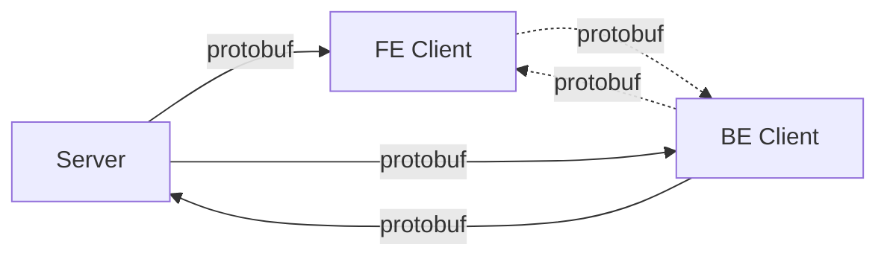

## protobuf


### proto

https://github.com/protocolbuffers/protobuf

https://developers.google.com/protocol-buffers/docs/reference/javascript-generated

### server


### brower

#### js

[protobufjs](https://www.npmjs.com/package/protobufjs)

#### ts

[ts-protoc-gen](https://www.npmjs.com/package/ts-protoc-gen)

```bash
protoc --plugin=protoc-gen-ts="{ABSOLUTEPATH}\node_modules\.bin\protoc-gen-ts.cmd" 
       --js_out="import_style=commonjs,binary:src/app/generated" 
       --ts_out="service=grpc-web:src/app/generated" src/app/protos/{YOURPROTOFILENAME}.proto
```


---



```bash
# filename: orderListRes-{git-commit-key}.proto

git pull
proto-git pull/push [Advanced CLI]
start/build
```

---

+ https://medium.com/francesco-pongetti/using-protocol-buffers-in-a-node-js-angular-web-application-fba17df8ab51
+ https://github.com/AnthonyGiretti/angular8-grpc-aspnetcore3-1-demo
+ https://segmentfault.com/a/1190000017055280
+ TODO: <https://grpc.io/>